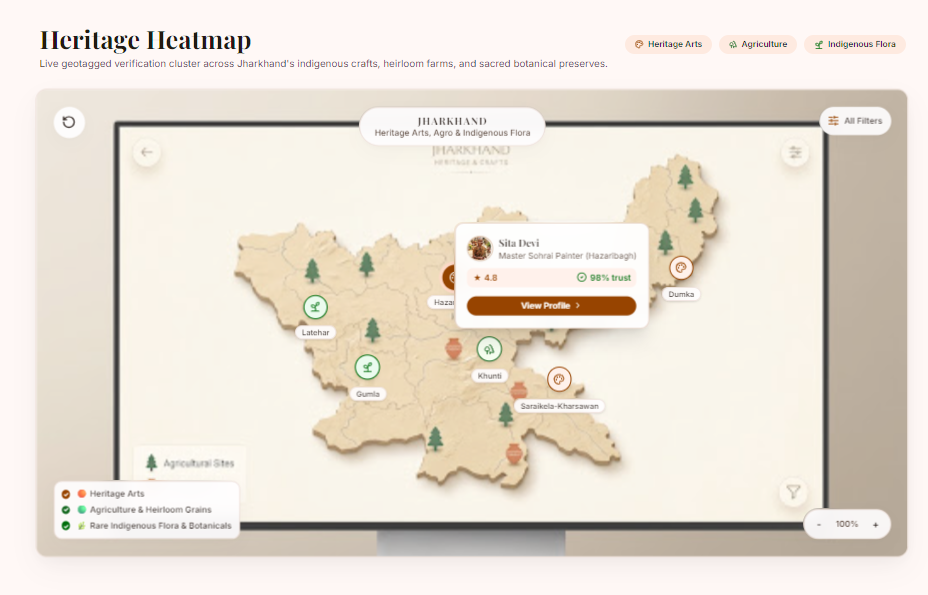
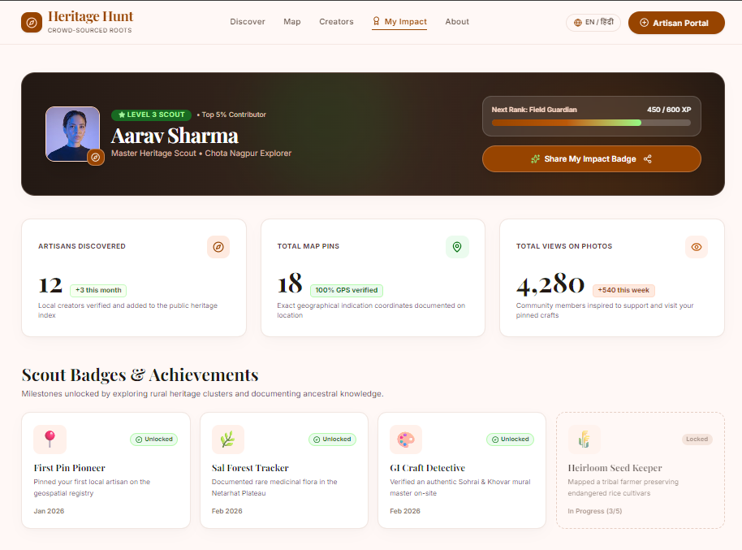
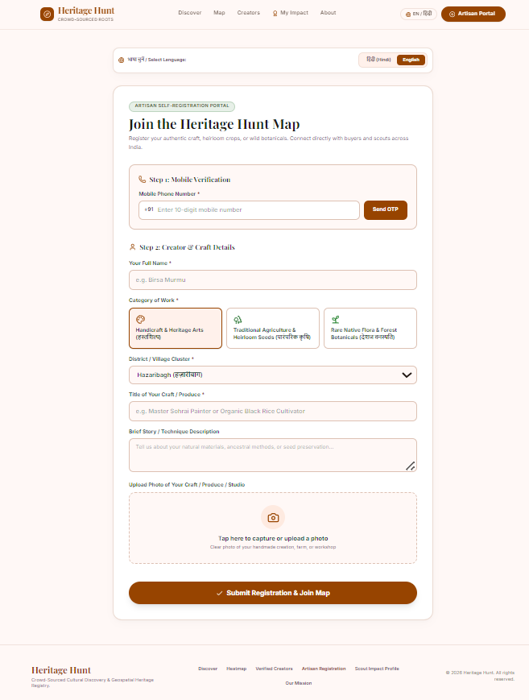

<div align="center">
  
  # 🌍 Heritage Hunt

  **Empowering Rural Artisans & Indigenous Farmers through Crowd-Sourced Digital Discovery**

  [](https://geo-origin.vercel.app/)
  [](https://sih.gov.in/)

</div>

---

## 📌 Project Overview
**Heritage Hunt** bridges the digital divide for rural artisans and indigenous farmers. Traditional creators often cultivate high-value, culturally rich products but lack the digital literacy to navigate complex e-commerce platforms or social media algorithms. 

Instead of forcing rural creators to learn complex tech, our platform uses a **Dual-Engine Growth Model**:
1. **The Buyer-Driven Engine:** Tech-savvy urban buyers act as "Heritage Scouts," discovering offline artisans and putting them on our live map in exchange for gamified social clout. 
2. **The Self-Serve Engine:** Tech-aware rural creators can onboard themselves in under two minutes using a simple mobile-friendly, language-accessible portal.

---

## 🚀 Core Features

*   **🗺️ Interactive Heritage Heatmap**
    Built with Google Maps API, users can visually discover authentic local crafts, heirloom seeds, and indigenous produce clustered by geographical origin.
*   **🏆 Buyer Impact Profile (Gamification)**
    Buyers earn "Heritage Scout" badges and track their grassroots impact (e.g., *Artisans Discovered*, *Map Pins Added*). They can share these verified impact stats directly to their social media.
*   **📱 Artisan Self-Registration Portal**
    A highly accessible, low-friction entry point for smartphone-enabled rural creators to build a digital footprint using minimal text and direct photo uploads.
*   **📖 The "Roots" Knowledge Hub**
    A built-in digital encyclopedia documenting the cultural, historical, and ecological significance of regional arts and native crops.

---

## 💻 Tech Stack

Our platform is built for speed, scalability, and seamless user experience using the **MERN** stack.

| Domain | Technologies Used |
| :--- | :--- |
| **Frontend** | React.js (Vite), Tailwind CSS, Lucide Icons |
| **Mapping & Location** | Google Maps JavaScript API, HTML Geolocation |
| **Backend** | Node.js, Express.js |
| **Database** | MongoDB Atlas (utilizing `2dsphere` spatial indexing) |
| **Media Storage** | Cloudinary (via Multer) |
| **Deployment** | Vercel (Frontend) |

---

## 🛠️ Local Setup & Installation

To run this project locally, follow these steps:

**1. Clone the repository**
```bash
git clone [https://github.com/your-username/heritage-hunt.git](https://github.com/your-username/heritage-hunt.git)
cd heritage-hunt
```
**2. Install Frontend Dependencies**
```bash
cd client
npm install
```
**3. Install Backend Dependencies**
```bash
cd ../server
npm install
```
**4. Environment Variables**
Create a .env file in both the client and server directories and add the following keys:

Client .env:

```Code snippet
VITE_GOOGLE_MAPS_API_KEY=your_api_key_here
VITE_BACKEND_URL=http://localhost:5000
```

Server .env:

```Code snippet
MONGO_URI=your_mongodb_atlas_connection_string
PORT=5000
CLOUDINARY_CLOUD_NAME=your_cloudinary_name
CLOUDINARY_API_KEY=your_api_key
CLOUDINARY_API_SECRET=your_api_secret
```

**5. Run the Application**

Start the backend server (runs on port 5000):

```bash
cd server
npm start
```

Start the frontend development server (runs on port 5173):

```bash
cd client
npm run dev
```

## 📸 Screenshots

<p> Heritage Heatmap </p>
 

<p> Buyer Impact Profile </p>


<p> Artisan Registration </p>


## 👥 About the Team

This project was built for the Smart India Hackathon internal round by a team of first-year CSE & IT undergraduate students from UCET, VBU Hazaribagh. We built this to learn, discover our technical blind spots, and create a solution with genuine grassroots impact.

* Baishnavi Kumari
* Pallavee
* Aastha Kashyap
* Astha Gupta
* Khushi Kumari
* Subhadra Murmu
